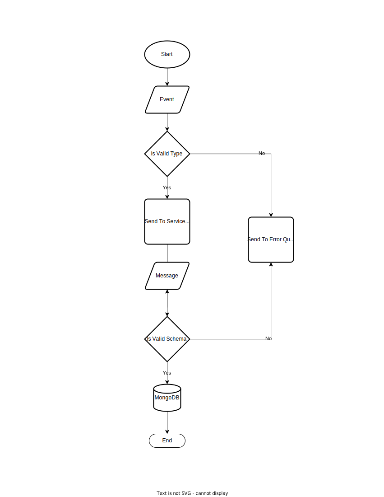

# Spls.ae Assesment For Backend Developer Position

This repository is the assesment for my application for a backend developer position at [spls.ae](https://spls.ae).

## Description

The assesment is to build multiple services that reads from Azure event-hubs, writes to Azure service-bus and eventually read from Azure service-bus to write to mongodb.

## Architecture

The below diagram shows the architecture overview.


At the far left we have the events producer that sends events to out event-hubs service.

These events are then consumed by different node instances that are using the same consumer groups to enable load sharing.

Once the data is consumed, it will be processed and queued in the correct service-bus queue based on its type.

Once queued the message will be delivered to one of the insatnces node instances which will eventaully write the messasge to mongodb.

## Data Life Cycle



## Setup .env File and The Corresponding Azure Resources

Copy .env.example file and fill the empty variables with the correct values.

### event-hubs-sender

| **Variable**                 | **Example** | **Description** |
| ---------------------------- | ----------- | --------------- |
| **EVENT_HUBS_RESOURCE_NAME** | slpsae      |
| **EVENT_HUBS_NAME**          | slpsae      |

### events-hub-ingesters

| **Variable**                   | **Example** | **Description**           |
| ------------------------------ | ----------- | ------------------------- |
| CONSUMER_GROUP                 | $Default    |
| EVENT_HUBS_RESOURCE_NAME       | slpsae      |
| EVENT_HUBS_NAME                | slpsae      |
| STORAGE_ACCOUNT_NAME           | slpsae      |
| STORAGE_CONTAINER_NAME         | slpsae      |
| MESSAGE_TYPE_A_QUEUE           | a_queue     | queue type A messages     |
| MESSAGE_TYPE_B_QUEUE           | b_queue     | queue type B messages     |
| MESSAGE_TYPE_C_QUEUE           | c_queue     | queue type C messages     |
| MESSAGE_VALIDATION_ERROR_QUEUE | error       | queue type error messages |
| SERVICE_BUS_RESOURCE_NAME      | splsae      |

### service-bus-ingesters

| **Variable**                       | **Example**                                          | **Description**           |
| ---------------------------------- | ---------------------------------------------------- | ------------------------- |
| **MESSAGE_TYPE_A_QUEUE**           | a_queue                                              | queue type A messages     |
| **MESSAGE_TYPE_B_QUEUE**           | b_queue                                              | queue type B messages     |
| **MESSAGE_TYPE_C_QUEUE**           | c_queue                                              | queue type C messages     |
| **MESSAGE_VALIDATION_ERROR_QUEUE** | error                                                | queue type error messages |
| **SERVICE_BUS_RESOURCE_NAME**      | splsae                                               |
| **DATABASE_URL**                   | mongodb://127\.0\.0\.1:27017/splsae?authSource=admin |

> Remember to create all the resources in azure portal.

## Define The Roles

Before running the app make sure all the roles for each service are met by the environment running the services.

All the services use [DefaultAzureCredential](https://learn.microsoft.com/en-us/javascript/api/overview/azure/identity-readme?view=azure-node-latest#defaultazurecredential) so make sure one of the credential exists in your environment.

To run `apps/event-hubs-sender` you need the following roles:

- `Azure Event Hubs Data Sender` (required to send events)

To run `apps/events-hub-ingesters` you need the following roles:

- `Azure Event Hubs Data Receiver` (required to receive events)
- `Azure Service Bus Data Sender` (required to send messages)
- `Storage Blob Data Contributor` (required to save checkpoints)

To run `apps/service-bus-ingesters` you need the following roles:

- `Azure Service Bus Data Sender` (required to send error messages)
- `Azure Service Bus Data Receiver` (required to receive messages)

## Run The Database

Make sure to have a mongodb database up and running with `replication` enabled.  
Prisma requires replication to work with mongodb.

You can run you own instance or use the docker compose file to run a local mongodb instance with replication enabled and configured without any further configuration.

## Run The Application

Now you all set, you can run the following commands to run each service.

```bash
# apps/event-hubs-sender
$ pnpm start event-hubs-sender

# apps/events-hub-ingesters
$ pnpm start events-hub-ingesters

# apps/service-bus-ingesters
$ pnpm start service-bus-ingesters
```

## Run Every Thing In Docker

You can go with the easy option and run everything in docker.

First of all let's build the images

```bash
# builds events-hub-ingesters
docker build -t splsae/events-hub-ingesters . --target events-hub-ingesters
# builds event-hubs-sender
docker build -t splsae/event-hubs-sender . --target event-hubs-sender
# builds service-bus-ingesters
docker build -t splsae/service-bus-ingesters . --target service-bus-ingesters
```

Once everything is built, go ahead and copy .env.docker.example and tweek the values.

```bash
cp .env.docker.example .env.docker
```

> Note that the container will not have azure cli so make sure to provide another method to authenticate the application, i used `AZURE_TENANT_ID`, `AZURE_CLIENT_ID` and `AZURE_CLIENT_SECRET`.

Now let's start the database:

```bash
# runs the database
docker compose -f ./docker-compose.dev.yaml up db -d
# initiate replica set
pnpm run docker:db:initiate-rs
```

You should see the following output:

```bash
{ ok: 1 }
```

Now you can start the other services:

```bash
docker compose -f ./docker-compose.dev.yaml up service-bus-ingesters event-hubs-sender events-hub-ingesters
```

## Sending Events

navigate to [localhost:3000/api](http://localhost:3000/api) and use the Swagger UI to send a message.

You can use one of the templates below to test each case.

### Message Type A

```json
{
  "type": "type_a",
  "propertyA": "somevalue"
}
```

### Message Type B

```json
{
  "type": "type_a",
  "propertyA": "somevalue"
}
```

### Message Type C

```json
{
  "type": "type_a",
  "propertyA": "somevalue"
}
```

### Invalid Message (will be queued from event-hubs service)

```json
{
  "type": "none-existing-type",
  "propertyA": "somevalue"
}
```

### Invalid Message (will be queued from service-bus service)

```json
{
  "type": "type_a",
  "invalidPropertyKeyForTypeA": "invalid"
}
```

make sure to view the logs for any issues.

## License

Nest is [MIT licensed](LICENSE).
